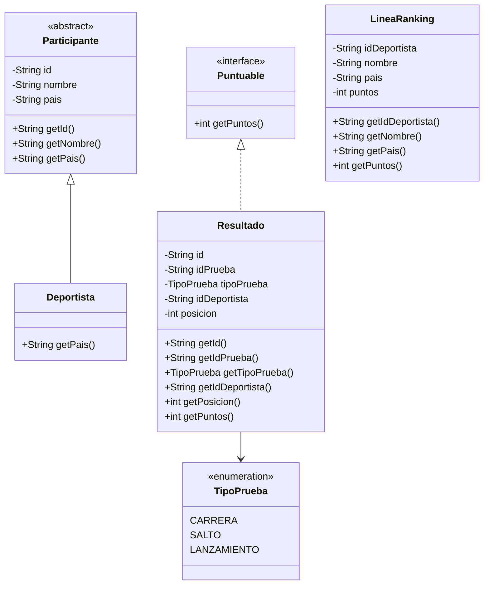
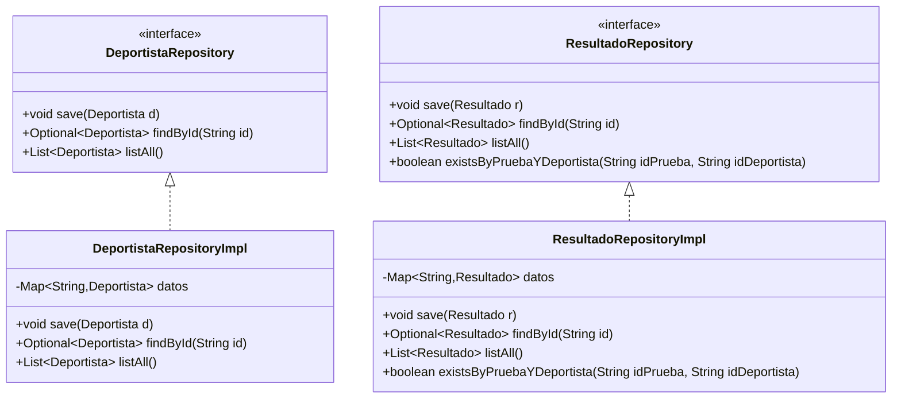
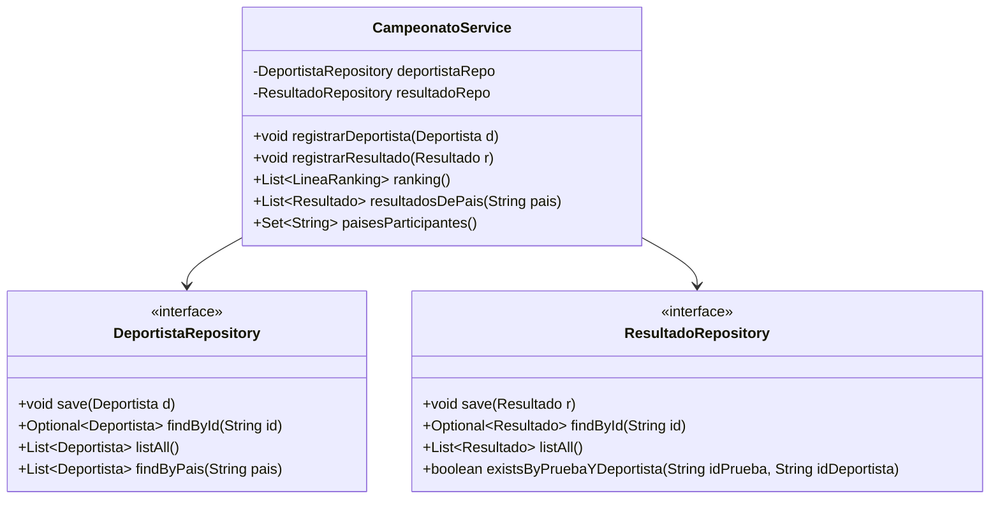

# Examen práctico DAM1 — Programación + Entornos de Desarrollo
**Temática:** Campeonato deportivo / olimpiadas (consola, Java 21)

---

## Contexto
El centro organiza un **campeonato** (tipo olimpiada escolar). Hay **deportistas** y **resultados** (posiciones) en distintas pruebas.
Se pide una aplicación Java **de consola** para:

1) **Leer** deportistas y resultados desde un fichero (CSV recomendado)
2) Registrar la información en memoria
3) Calcular un **ranking por puntos** y consultas simples
4) **Escribir** el resultado a un fichero de salida

> Importante: este repositorio **no trae implementaciones** de modelo/repos/servicios. Debes crearlas tú siguiendo el diagrama y los requisitos.

---

# 1) Requisitos de Entornos de Desarrollo (ED)

## 1.1 GitHub (Fork + Project + Issues + PR)
1. Haz **FORK** de este repositorio a tu cuenta.
2. Crea un **GitHub Project** (tablero) en tu fork con columnas:
    - Pendiente (To do)
    - En proceso (In progress)
    - En revisión (In review)
    - Hecho (Done)
3. Crea al menos **3 Issues** (tareas) y colócalos en el Project.
4. Trabaja con ramas `feature/*`.
5. **Cualquier cambio que quieras integrar en `main` debe entrar mediante una Pull Request (PR)** (no se permite merge directo).
6. **Cada PR debe quedar aprobada por ti** (self-review) antes de hacer el merge.
7. Cada PR debe enlazar un Issue (por ejemplo: `Closes #3`).

---

# 2) Requisitos de Maven (ED) — obligatorio

## 2.1 Java
El proyecto debe compilar con **Java 21**.

## 2.2 Dependencias obligatorias (añadir en `pom.xml`)
Debes añadir exactamente estas dependencias y versiones:

- **Apache Commons CSV**
    - groupId: `org.apache.commons`
    - artifactId: `commons-csv`
    - version: `1.14.1`

- **JUnit Jupiter (JUnit 5)**
    - groupId: `org.junit.jupiter`
    - artifactId: `junit-jupiter`
    - version: `5.10.2`
    - scope: `test`

- **Mockito JUnit Jupiter**
    - groupId: `org.mockito`
    - artifactId: `mockito-junit-jupiter`
    - version: `5.12.0`
    - scope: `test`

## 2.3 Plugins
- El plugin **`maven-surefire-plugin`** (tests) **ya está configurado** en este repositorio y **no tienes que tocarlo**.
- Debes configurar el plugin **`exec-maven-plugin`** para poder ejecutar con `mvn exec:java`:
    - groupId: `org.codehaus.mojo`
    - artifactId: `exec-maven-plugin`
    - version: `3.6.3`
    - `<mainClass>es.fplumara.dam1.campeonato.app.Main</mainClass>`

✅ Debe poder ejecutarse:
- `mvn clean test`
- `mvn exec:java`

---

# 3) Requisitos de Programación

## 3.1 Capas y paquetes
Debes organizar el código por capas usando estos paquetes:

- `es.fplumara.dam1.campeonato.app`
- `es.fplumara.dam1.campeonato.model`
- `es.fplumara.dam1.campeonato.repository`
- `es.fplumara.dam1.campeonato.service`
- `es.fplumara.dam1.campeonato.io`
- `es.fplumara.dam1.campeonato.exception`

---

## 3.2 Diagrama de clases — Modelo



**Puntuación (sencilla)**
- Posición 1 → 5 puntos
- Posición 2 → 3 puntos
- Posición 3 → 1 punto
- Cualquier otra → 0 puntos

> Esta lógica debe estar en `Resultado.getPuntos()` (uso de interface `Puntuable`) y el tipo de prueba se representa con el enum `TipoPrueba`.


## 3.3 Repositorios — 2 repositorios (no genéricos)

Los repositorios deben almacenar datos en memoria usando `Map` internamente.

### 3.3.1 Qué significan los métodos del repositorio
- `save(...)`
    - Guarda el elemento en el repositorio (internamente en un `Map`).
- `findById(...) -> Optional<...>`
    - Busca por id. Si no existe, devuelve `Optional.empty()`.
- `listAll() -> List<...>`
    - Devuelve una lista con **todos** los elementos.
- `findByPais(String pais) -> List<Deportista>` *(solo en DeportistaRepository)*
    - Devuelve los deportistas de un país (filtrado de colecciones).
    - Se evalúa el uso de `List` aquí (y Streams es recomendable).

> No se pide `delete()` para simplificar el examen.


### 3.3.2 Diagrama — Repositorios (Map + Optional + List)
(Map + Optional + List)



---

## 3.4 Servicio — 1 service que usa 2 repositorios

### 3.4.1 Excepciones propias (obligatorias)
Crea y usa estas excepciones en `...exception`:
- `DuplicadoException` (cuando se intenta guardar algo con un id ya existente)
- `NoEncontradoException` (cuando se referencia un id que no existe)
- `OperacionNoPermitidaException` (cuando una regla del campeonato impide la operación)

### 3.4.2 Diagrama — Servicio



### 3.4.3 Reglas del servicio (obligatorias)
Crea `CampeonatoService` con estas reglas:

- `registrarDeportista(Deportista d)`
    - si `d` es null o id/nombre/pais es null/vacío → `IllegalArgumentException`
    - si ya existe un deportista con ese id → `DuplicadoException`
    - si todo ok → guarda

- `registrarResultado(Resultado r)`
    - si `r` es null o id/idPrueba/idDeportista es null/vacío → `IllegalArgumentException`
    - si `tipoPrueba` es null → `IllegalArgumentException`
    - si `posicion <= 0` → `IllegalArgumentException`
    - si ya existe un resultado con ese id → `DuplicadoException`
    - si el deportista no existe → `NoEncontradoException`
    - regla del campeonato: un deportista **solo puede tener 1 resultado por prueba**
        - si `resultadoRepo.existsByPruebaYDeportista(idPrueba, idDeportista)` → `OperacionNoPermitidaException`
    - si todo ok → guarda

- `ranking() -> List<LineaRanking>`
    - suma puntos por deportista a partir de `Resultado.getPuntos()`
    - devuelve lista ordenada por puntos (descendente)
    - **se evalúa** que hagas filtrado/transformación de colecciones aquí (Streams recomendado)

- `resultadosDePais(String pais) -> List<Resultado>`
    - obtiene primero los deportistas de ese país con `deportistaRepo.findByPais(pais)`
    - y devuelve los resultados cuyos `idDeportista` estén en esa lista (filtrado/transformación de colecciones)

- `paisesParticipantes() -> Set<String>`
    - devuelve el conjunto de países (sin repetidos) de los deportistas registrados (**uso obligatorio de Set**)

**Estructuras obligatorias en el proyecto**
- `Map`: en `DeportistaRepositoryImpl` y `ResultadoRepositoryImpl` (almacenamiento)
- `List`: en `listAll()` y en ranking/filtrados
- `Set`: en `paisesParticipantes()`

---

## 3.5 Lectura y escritura de ficheros (CSV recomendado)

Debes implementar lectura y escritura usando ficheros **CSV** (recomendado) con Apache Commons CSV.

### Formato de entrada `deportistas.csv`
```csv
id,nombre,pais
D001,Ana,ES
D002,Bruno,PT
D003,Carla,ES
```

### Formato de entrada `resultados.csv`
```csv
id,idPrueba,tipoPrueba,idDeportista,posicion
R001,P001,CARRERA,D001,1
R002,P001,CARRERA,D002,2
R003,P002,SALTO,D003,3
```

### Salida obligatoria `ranking.csv`
Debe escribirse un fichero `ranking.csv` con:
```csv
idDeportista,nombre,pais,puntos
D001,Ana,ES,5
D002,Bruno,PT,3
D003,Carla,ES,1
```

> Puedes crear clases en `...io` para leer/escribir. Se evalúa que el programa **lea** y **escriba** ficheros correctamente.

---

# 4) Tests unitarios (JUnit + Mockito) — obligatorio

Debes crear tests unitarios de `CampeonatoService` con Mockito (repositorios mock).

**No se te da una lista de tests cerrada.**  
Debes diseñar los tests que consideres necesarios **cubriendo todos los casos posibles**:
- casos OK
- duplicados
- no encontrados
- validaciones (null/vacíos, posición <= 0)
- regla “1 resultado por prueba y deportista”
- ranking (sumas y ordenación)

Requisitos:
- usar `@ExtendWith(MockitoExtension.class)`
- mocks de repositorio(s)
- al menos en los casos OK, usar `verify(...)`

---

# 5) Programa principal (mínimo)

En `app.Main` demuestra un flujo simple (sin menú complejo), con rutas fijas:

1. Crear repositorios (`DeportistaRepositoryImpl`, `ResultadoRepositoryImpl`)
2. Crear `CampeonatoService`
3. Leer `deportistas.csv` y registrar deportistas (service)
4. Leer `resultados.csv` y registrar resultados (service)
5. Mostrar por consola:
    - `paisesParticipantes()` (Set)
    - `ranking()` (List ordenada)
    - `resultadosDePais("ES")` (List filtrada)
6. Escribir `ranking.csv` a disco

---

## Entrega
- Enlace a tu fork (público o accesible)
- `main` debe pasar: `mvn clean test`
- Debe poder ejecutarse: `mvn exec:java`
- PRs y Project deben reflejar tu trabajo
# campeonatos
